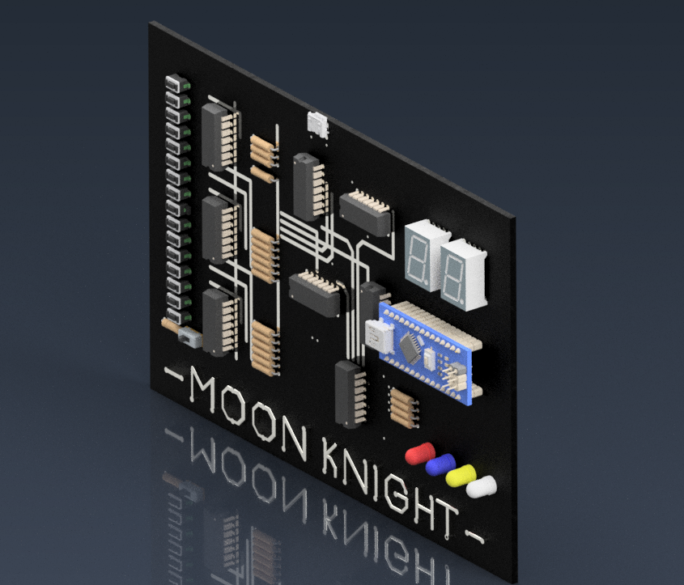

# Binary Encoder 16 to 4 With Enable

This PCB project is a binary encoder with 16 inputs and 4 outputs, with an enable input. The encoder converts a 16-bit binary input value into a 4-bit binary output value. The enable input allows the user to control when the encoder is active, allowing the output to be held in a known state when the encoder is not in use.

Overall, this project is a PCB design, with schematics created using Eagle and a 3D model created using Fusion 360.



## Getting Started

These instructions will get you a copy of the project up and running on your local machine for development and testing purposes.

### Prerequisites

To run this project, you will need to have the following software and libraries installed on your computer:

- Eagle
- Fusion 360

### Installing

To install this project, follow these steps:

1. Clone the repository:
```
git clone https://github.com/farisrfp/encoder-16bit
```
2. Open the `skematik.sch` file in Eagle to view the schematics.

3. Open the `fp.iam` file in Fusion 360 to view and edit the 3D model.

4. Use the 3D modeling software to export the 3D model in a format that can be previewed, such as STL or OBJ.

## Built With

- [Eagle](https://www.autodesk.com/products/eagle/overview) - The software used for creating the schematics
- [Fusion 360](https://www.autodesk.com/products/fusion-360/overview) - The software used for creating the 3D model

## Contributing

If you would like to contribute to this project, please follow these guidelines:

1. Fork the repository
2. Create a new branch for your changes (`git checkout -b my-changes`)
3. Commit your changes (`git commit -am 'Added some new features'`)
4. Push to the new branch (`git push origin my-changes`)
5. Create a new Pull Request
